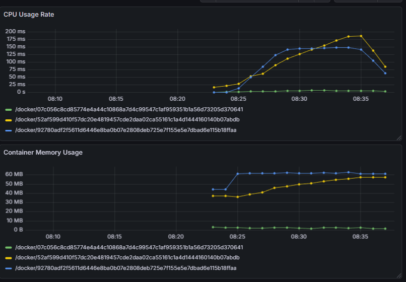
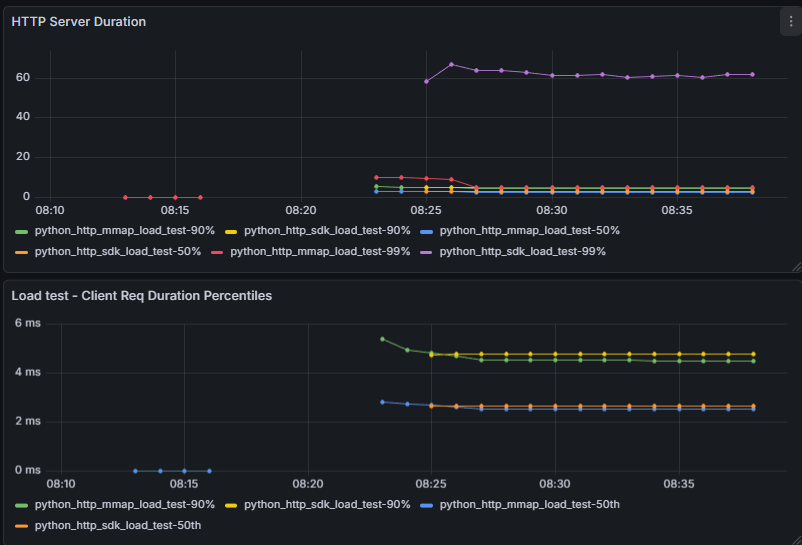
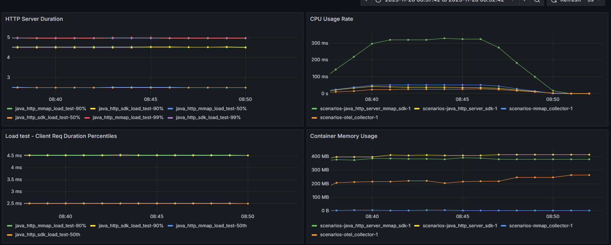

# Benchmarking

This directory contains benchmarking plans, findings and next steps.

## Overall

Right now, the MMAP collector is not what a fully featured collector has, so we can expect some more overhead as that gets
added, however we've found the following to be true:

- For Java
  - Memory usage for the mmap collector is still less than the Java SDK.  That is, *combined*
    the mmap-collector + mmap-sdk in Java use less RAM than just Java SDK itself.
  - Performance on the critical path is on-par, with a slight slowdown: about
    ~10-20 us, which we'd expected due to atomic operations.
  - Overall CPU usage for mmap-collector + mmap-sdk is MUCH higher than Java SDK, with the
    mmap-demo java process consuming ~300ms of a CPU vs. Java SDK using ~50ms in that same time period. This is likely due to spin-wait loops on the RingBuffers, but needs to be profiled.
- General Observations
  - The mmap-collector is able to flood the OTEL collector and force backpressure. This is NOT
    handled well on the mmap-collector side, and may lead to crashing or slowdown of the mmap
    benchmark.

## 2026-02-19 - Initial Python Benchmarking reuslts.

This was tested using the `python-mmap-sdk-vs-pure-sdk.docker-compose.yml` scenario.




Legend:

- `/docker/...70641` (green) is the mmap-collector container
- `/docker/...7abdb` (yellow) is the python MMAP SDK container
- `/docker/...8ffaa` (blue) is the python "vanilla" SDK container

Note: This was using the "debug" version of `Flask` serving, not gunicorn.
We will need to spend more time figuring out an OTLP-MMAP SDK that is gunicorn
compatible and update the demo container.  As such, we had to severely limit
active requests for this benchmark, so we would not overrun the single flask
python process.

Overall observations:

- Total memory usage for Python + MMAP Collector is actually *below* the
  OpenTelemetry SDK.  We saw this in Java, but did not expect to see the same
  in Python.
- CPU Usage increases over time for the MMAP implementation. We'll need to
  debug the Rust cache implementation to see if this is related.
- Latency on the MMAP SDK remains about *half* of the python SDK, with
  much less variance as well (see k6 reports below). We *do* see significant improvement in performance although how much is attributed to using a rust FFI and how much comes from the mmap synchronous export is unclear. 

TODOs:

- Update python demo to use gunicorn, and increate k6 load.
- Look into profiling to determine where time is spent.
- See if there are python runtime metrics that could also be reported.

### K6 Report - Vanilla SDK

```
THRESHOLDS 
    checks
    ✓ 'rate>0.99' rate=99.99%
    http_req_duration
    ✓ 'p(99) < 500' p(99)=58.7ms
TOTAL RESULTS 
    checks_total.......: 58332  94.838176/s
    checks_succeeded...: 99.99% 58327 out of 58332
    checks_failed......: 0.00%  5 out of 58332
    ✗ is status 200
      ↳  99% — ✓ 58327 / ✗ 5
    HTTP
    http_req_duration..............: avg=3.39ms   min=0s       med=1.18ms   max=115.89ms p(90)=2.72ms   p(95)=8.69ms 
      { expected_response:true }...: avg=3.39ms   min=655.39µs med=1.18ms   max=115.89ms p(90)=2.72ms   p(95)=8.7ms  
    http_req_failed................: 0.00%  5 out of 58332
    http_reqs......................: 58332  94.838176/s
    EXECUTION
    iteration_duration.............: avg=104.17ms min=100.74ms med=102.14ms max=216.54ms p(90)=103.48ms p(95)=109.6ms
    iterations.....................: 58332  94.838176/s
    vus............................: 1      min=1          max=10
    vus_max........................: 10     min=10         max=10
    NETWORK
    data_received..................: 11 MB  18 kB/s
    data_sent......................: 4.8 MB 7.9 kB/s
```

### K6 Report - MMAP SDK

```
THRESHOLDS 
    checks
    ✓ 'rate>0.99' rate=99.99%
    http_req_duration
    ✓ 'p(99) < 500' p(99)=3.77ms
TOTAL RESULTS 
    checks_total.......: 59449  96.657372/s
    checks_succeeded...: 99.99% 59446 out of 59449
    checks_failed......: 0.00%  3 out of 59449
    ✗ is status 200
      ↳  99% — ✓ 59446 / ✗ 3
    HTTP
    http_req_duration..............: avg=1.47ms   min=0s       med=1.19ms   max=18.4ms   p(90)=2.24ms   p(95)=2.64ms  
      { expected_response:true }...: avg=1.47ms   min=624.72µs med=1.19ms   max=18.4ms   p(90)=2.24ms   p(95)=2.64ms  
    http_req_failed................: 0.00%  3 out of 59449
    http_reqs......................: 59449  96.657372/s
    EXECUTION
    iteration_duration.............: avg=102.21ms min=100.79ms med=102.11ms max=119.76ms p(90)=103.09ms p(95)=103.43ms
    iterations.....................: 59449  96.657372/s
    vus............................: 1      min=1          max=10
    vus_max........................: 10     min=10         max=10
    NETWORK
    data_received..................: 11 MB  18 kB/s
    data_sent......................: 5.2 MB 8.5 kB/s
running (10m15.0s), 00/10 VUs, 59449 complete and 0 interrupted iterations
default ✓ [ 100% ] 00/10 VUs  10m15s
```

## 2025-11-28 - Benchamrking Results

This was tested using the `mmap-sdk-vs-pure-sdk.docker-compose.yml` scenario.



- Memory usage for the mmap collector is still less than the Java SDK.  That is, *combined*
the mmap-collector + mmap-sdk in Java use less RAM than just Java SDK itself.
- Performance on the critical path is on-par, with a slight slowdown: about
~10-20 us, which we'd expected due to atomic operations.
- Overall CPU usage for mmap-collector + mmap-sdk is MUCH higher than Java SDK, with the
mmap-demo java process consuming ~300ms of a CPU vs. Java SDK using ~50ms in that same time period. This is likely due to spin-wait loops on the RingBuffers, but needs to be profiled.
- We tweaked the tokio configuration of mmap-collector and found that using `tokio::spawn`
  for interacting with the ringbuffers actually lead to dramatically slowdown due to forcing
  too much contention on the ringbufer spin-locks.

### TODOs

- [ ] Need to investigate/profile higher CPU usage on the Java MMAP SDK implementation. See if
      we can lower it.
- [ ] Run a new benchmark where we can alter the spin-lock wait times and retry cycle
      to try to force a better optimium.
- [ ] mmap-collector needs to support backpressure and crash-restarting.
- [ ] JVM metrics are not making it from MMap SDK -> LGTM even though HTTP server metrics are. This needs to be fixed.
